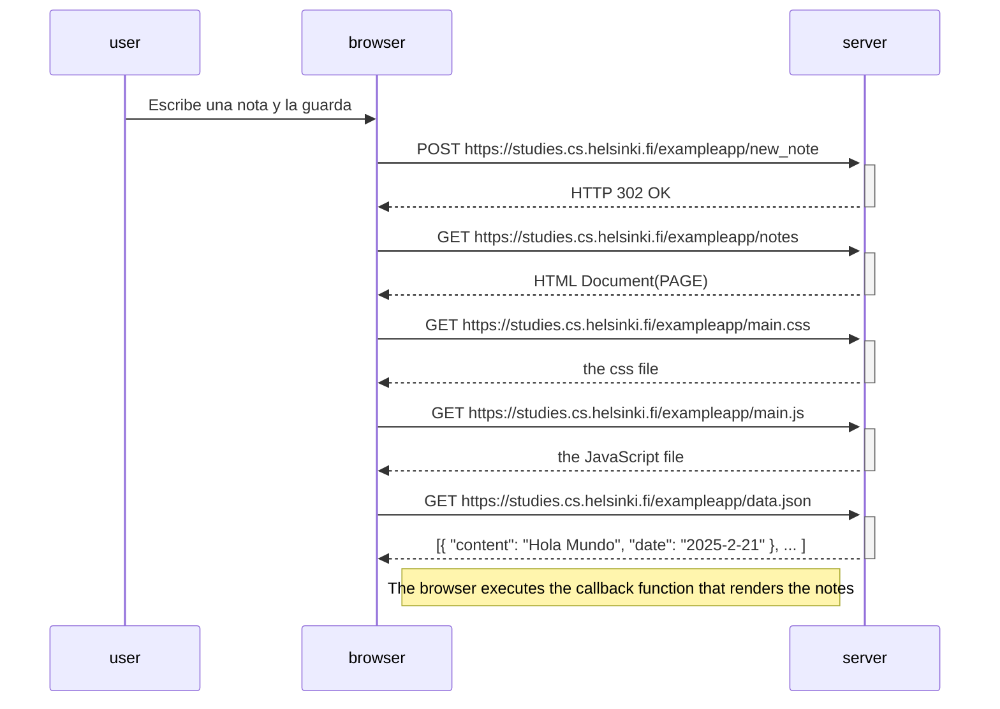

```mermaid

sequenceDiagram
    participant user
    participant browser
    participant server

    user->>browser: Escribe una nota y la guarda
    activate server

    browser->>server: POST https://studies.cs.helsinki.fi/exampleapp/new_note
    activate server
    server -->>browser: HTTP 302 OK
    deactivate server


    browser->>server: GET https://studies.cs.helsinki.fi/exampleapp/notes
    activate server
    server-->>browser: HTML Document(PAGE)
    deactivate server

    browser->>server: GET https://studies.cs.helsinki.fi/exampleapp/main.css
    activate server
    server-->>browser: the css file
    deactivate server

    browser->>server: GET https://studies.cs.helsinki.fi/exampleapp/main.js
    activate server
    server-->>browser: the JavaScript file
    deactivate server

    browser->>server: GET https://studies.cs.helsinki.fi/exampleapp/data.json
    activate server
    server-->>browser: [{ "content": "Hola Mundo", "date": "2025-2-21" }, ... ]
    deactivate server

    Note right of browser: The browser executes the callback function that renders the notes
```
