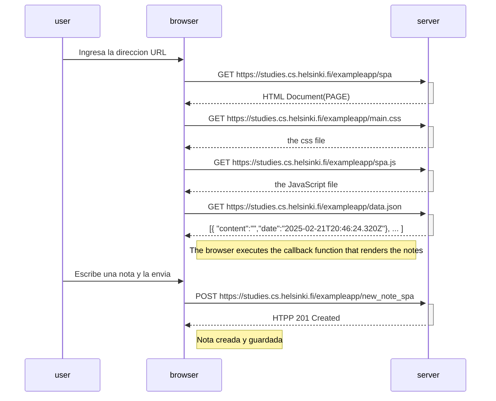

```mermaid

sequenceDiagram
    participant user
    participant browser
    participant server

    user->>browser: Ingresa la direccion URL
    activate server

    browser->>server: GET https://studies.cs.helsinki.fi/exampleapp/spa
    activate server
    server-->>browser: HTML Document(PAGE)
    deactivate server

    browser->>server: GET https://studies.cs.helsinki.fi/exampleapp/main.css
    activate server
    server-->>browser: the css file
    deactivate server

    browser->>server: GET https://studies.cs.helsinki.fi/exampleapp/spa.js
    activate server
    server-->>browser: the JavaScript file
    deactivate server

    browser->>server: GET https://studies.cs.helsinki.fi/exampleapp/data.json
    activate server
    server-->>browser: [{ "content":"","date":"2025-02-21T20:46:24.320Z"}, ... ]
    deactivate server

    Note right of browser: The browser executes the callback function that renders the notes

    user ->> browser: Escribe una nota y la envia

    browser->>server: POST https://studies.cs.helsinki.fi/exampleapp/new_note_spa
    activate server
    server-->>browser:HTPP 201 Created
    deactivate server
    Note right of browser: Nota creada y guardada
```
